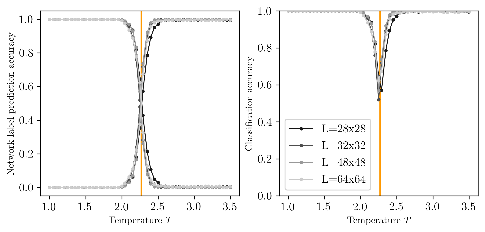
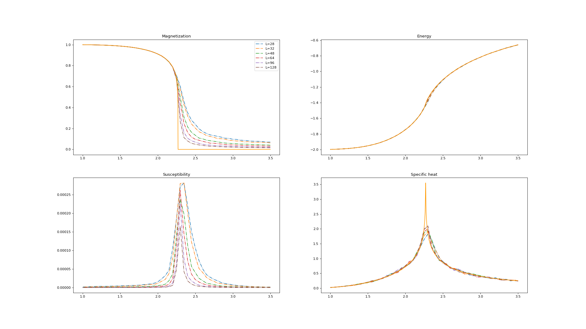

# The Ising Model

## Short summary
The Ising dataset contains spin-configuration snapshots. Each snapshot is labeled with a temperature (continuous) and a phase (binary) classification label ([further details below](#Descriptions)). Each set consists of 1.000 samples per temperature $T$ in the range $T = 1.0$ to $T=3.5$ in steps of size $0.05$, totalling to $51,000$ samples per dataset.

Here are some example snapshots in this dataset, with temperature $T$ and label $\ell$ indicated.


Different system sizes are available to allow for a finite-size scaling analysis.

## Download
If you use this dataset for a publication, please cite the ...

Below are datasets with various system sizes in the `.npy` format, suitable for use in python. If you require alternative file formats, they are provided below. 

| Name  	|  Size 	|  MD5 Checksum  	| 
| :--- | :---: | :--- | 
| [ising-28x28-npy.tar.gz](https://github.com/quantumdata/data/releases/tag/v0.1-alpha) | 6.6MB  	| e933f050f6b2bcc5d20595a3f8a74744  	| 
| [ising-32x32-npy.tar.gz](https://github.com/quantumdata/data/releases/tag/v0.1-alpha)  | 8.6MB  	| 3032be59ab009080b69117ff5bece567  	|
| [ising-48x48-npy.tar.gz](https://github.com/quantumdata/data/releases/tag/v0.1-alpha)  | 19MB  	| bb6e72b74a45427abea53996d05753bf  	|
| [ising-64x64-npy.tar.gz](https://github.com/quantumdata/data/releases/tag/v0.1-alpha)  | 34MB  	| 7cf378e17b5b7e2316e6611f2b759652  	|

See [alternative formats](#alternative-formats) for other data formats.

## Dataset layout
Each compressed zip file contains two python archives, one with the snapshots and a separate one with labels. The following script shows how to load both:

```python
import numpy as np
snapshots    = np.load("ising-28x28.npy")
labels       = np.load("ising-28x28-lbl.npy")
phases       = labels[:,0]
temperatures = labels[:,1]
```

The temperatures in the dataset range from $T=1$ to $T=3.5$ in $51$ steps of size $0.05$, and each temperature has $1,000$ samples. The phase label takes values $0$ and $1$. The temperature closest to the transition temperature in the thermodynamic limit is $2.25$. 

## Descriptions
### Lay description
Each pixel in a snapshot represents a little magnetic arrow (a.k.a a *spin*) variable, pointing either up (black, value +1) or down (white, value -1). These spins interact with their nearest neighbors, and try to align themselves. This alignment is only perfect at very small temperatures, resulting in a ferromagnetic system (phase label 0). As the temperature increases beyond critical, thermal fluctuations prevent the alignment and the system transitions into a paramagnetic system (phase label 1) where spins point up & down randomly. Possible machine learning applications on this dataset include:
* Learning to classify the snapshots into phase 0 or phase 1
* Extracting the transition temperature from aWhile you're here, check out this quantum game I madeWhile you're here, check out this quantum game I made reduced dataset including only the smallest and largest temperatures [[1,2]](#References).
* Learning the partition function $P(\textrm{configuration})$.

Refer to the [Baselines](#baselines) section for example results.

### Advanced description
Let $\{ \sigma_1, \sigma_2, ... \sigma_N \}$ be a set of $N$ spin variables on a 2D lattice, with each spin $\sigma_i \in \{ -1, +1 \}$. Spins at lattice points $i,j$ interact with their nearest neighbors (indicated by $\langle i,j \rangle$) only, with an interaction strength $J$. The Hamiltonian governing these spins is

$$\begin{aligned}
  H = -J\sum_{\langle i,j \rangle} \sigma_i\sigma_j
\end{aligned}$$

This model is exactly solvable, and the dataset uses labels taken from the exact solution. The snapshots are generated at a given temperature $T = 1/\beta$ by drawing samples according to the thermal distribution

$$\begin{aligned}
  P(\sigma | \beta) = \frac{1}{Z} \exp(-\beta H(\sigma)).
\end{aligned}$$

The samples are drawn using the [Metropolis-Hastings]() Monte Carlo algorithm in conjunction with Wolff cluster updates. 


## Baselines
### Unsupervised
#### Principal component analysis
See reference [4](Lei Wang)


### Supervised Learning
This model serves as a simple toy model for classifier architectures targeted at physical models. Many networks perform well on the dataset. An [example work](https://arxiv.org/abs/1605.01735) that illustrates a possible machine learning project on this dataset. We wish to classify the two different phases in the model. We can begin by defining a simple feed-forward net, a single layer fully connected neural net with ~100 hidden units with ReLU activation, dropout regularization, and softmax. 

This model performs quite well on our dataset, you should be able to obtain over 90% accuracy on our tests.

Another interesting way of evaluating our model is to see what sorts of output we get at what temperature. We expect very low temperature and very high temperature to be quite accurate, since they are either all random or all identical spins. Near the critical point, we would like to see how our model performs. 



There is also a point where our model "decides" to predict a different class more often. We can use temperatures around but not including the critical point to interpolate a critical point.

## Alternative formats
We provide alternative data formats for users not using `numpy` or python. [ising.txt]() is available for 


## More information
### Model history
In the 1920s, the idea of magnetism, particularly ferromagnetism, was beginning to be closely studied. Physicist Wilhelm Lenz proposed a mathematical model to his then student Ernst Ising (pronounced *EE-ZING*), to describe a system of spins which compose a ferromagnet. The microscopic configuration of such spins determine important physical properties of the material as a whole.

One of the questions of interest for a model like the Ising model is what are the physical properties and how do they arise. Given certain parameters what configurations is the model likely to take on, and what sorts of values should we expect for the observable quantities this model produces. For example, quantities of interest include the magnetization, average configuration energies, specific heat, etc. The other question we naturally should ask is given the set of physical observables, is it possible to determine which state the system originated from? If this is possible, by looking at the output of a neural network trained to recognized states, we can look at discontinuities when the network predicts one phase versus another.

### Physical Observables of the Ising Model

We can define the model of the configurations of Ising states. Let $\Lambda \{ \sigma_1, \sigma_2, ... \sigma_L \}$ be a set of size $L$ of interacting lattice points. At each site $i$, we have a spin $\sigma_i$ which can be either up or down, $\sigma_i \in \{ -1, +1 \}$. Spins at lattice points $i,j$ interact with interaction strength $J$. We also place the model in an external field $h$. In order to describe the system, we introduce the Hamiltonian which governs the energy of the system:

$$\begin{aligned}
  H = -J\sum_{\langle i,j \rangle} \sigma_i\sigma_j-h\sum_j \sigma_j
\end{aligned}$$

The notation $\langle i,j \rangle$ denotes nearest neighbours only. Since we have analytic solutions for the partition function, we can also calculate exact values of observables, including energy, specific heat, magnetization, and magnetic susceptibility. We can plot the real values from the dataset against theoretical values.



*Note that the size 28x28 system sizes suffers from finite size effects particularly in the magnetism*

## References {docsify-ignore}


Phys. Rev. 65 117 (1944)
1103.3347
1605.01735
http://micro.stanford.edu/~caiwei/me334/Chap12_Ising_Model_v04.pdf
